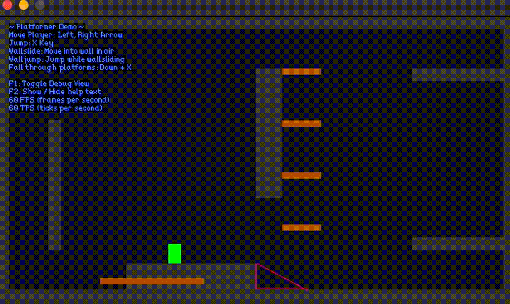

 <h1>Donburi</h1>

 [](https://pkg.go.dev/github.com/yohamta/donburi)

Donburi is an Entity Component System library for Go / Ebitengine inspired by [legion](https://github.com/amethyst/legion).

It aims to be a feature rich and high-performance [ECS](https://en.wikipedia.org/wiki/Entity_component_system) Library.

## Contents

- [Contents](#contents)
- [Summary](#summary)
- [Examples](#examples)
- [Installation](#installation)
- [Getting Started](#getting-started)
  - [Worlds](#worlds)
  - [Queries](#queries)
  - [Tags](#tags)
  - [Systems (Experimental)](#systems-experimental)
  - [Debug](#debug)
- [Features](#features)
  - [Math](#math)
  - [Transform](#transform)
  - [Events](#events)
- [Projects Using Donburi](#projects-using-donburi)
- [Architecture](#architecture)
- [How to contribute?](#how-to-contribute)
- [Contributors](#contributors)

## Summary

- It introduces the concept of [Archetype](https://docs.unity3d.com/Packages/com.unity.entities@0.2/manual/ecs_core.html), which allows us to query entities very efficiently based on the components layout.
- It is possible to combine `And`, `Or`, and `Not` conditions to perform complex queries for components.
- It avoids reflection for performance.
- Ability to dynamically add or remove components from an entity.
- Type-safe APIs powered by Generics
- Zero dependencies
- Provides [Features](#features) that are common in game dev (e.g., `math`, `transform`, `hieralchy`, `events`, etc) built on top of the ECS architecture.

## Examples

To check all examples, visit [this](https://github.com/yohamta/donburi/tree/master/examples) page.

The bunnymark example was adapted from [mizu](https://github.com/sedyh/mizu)'s code, which is made by [sedyh](https://github.com/sedyh). 

<a href="https://github.com/yohamta/donburi/tree/master/examples/bunnymark"> </a> <a href="https://github.com/yohamta/donburi/tree/master/examples/platformer"> </a> 

## Installation

```
go get github.com/yohamta/donburi
```

## Getting Started

### Worlds

```go
import "github.com/yohamta/donburi"

world := donburi.NewWorld()
```

Entities can be created via either `Create` (for a single entity) or `CreateMany` (for a collection of entities with the same component types). The world will create a unique ID for each entity upon insertion that we can use to refer to that entity later.

```go
// Component is any struct that holds some kind of data.
type PositionData struct {
  X, Y float64
}

type VelocityData struct {
  X, Y float64
}

// ComponentType represents kind of component which is used to create or query entities.
var Position = donburi.NewComponentType[PositionData]()
var Velocity = donburi.NewComponentType[VelocityData]()

// Create an entity by specifying components that the entity will have.
// Component data will be initialized by default value of the struct.
entity = world.Create(Position, Velocity)

// We can use entity (it's a wrapper of int64) to get an Entry object from World
// which allows you to access the components that belong to the entity.
entry := world.Entry(entity)

// You can set or get the data via the ComponentType
Position.SetValue(entry, math.Vec2{X: 10, Y: 20})
Velocity.SetValue(entry, math.Vec2{X: 1, Y: 2})

position := Position.Get(entry)
velocity := Velocity.Get(entry)

position.X += velocity.X
position.Y += velocity.y
```

Components can be added and removed through `Entry` objects.

```go
// Fetch the first entity with PlayerTag component
query := donburi.NewQuery(filter.Contains(PlayerTag))
// Query.First() returns only the first entity that 
// matches the query.
if entry, ok := query.First(world); ok {
  donburi.Add(entry, Position, &PositionData{
    X: 100,
    Y: 100,
  })
  donburi.Remove(entry, Velocity)
}
```

Entities can be removed from World with the World.Remove() as follows:

```go
if SomeLogic.IsDead(world, someEntity) {
  // World.Remove() removes the entity from the world.
  world.Remove(someEntity)
  // Deleted entities become invalid immediately.
  if world.Valid(someEntity) == false {
    println("this entity is invalid")
  }
}
```

Entities can be retrieved using the `First` and `Each` methods of Components as follows:

```go
// GameState Component
type GameStateData struct {
  // .. some data
}
var GameState = donburi.NewComponentType[GameStateData]()

// Bullet Component
type BulletData struct {
  // .. some data
}
var Bullet = donburi.NewComponentType[BulletData]()

// Init the world and create entities
world := donburi.NewWorld()
world.Create(GameState)
world.CreateMany(100, Bullet)

// Query the first GameState entity
if entry, ok := GameState.First(world); ok {
  gameState := GameState.Get(entry)
  // .. do stuff with the gameState entity
}

// Query all Bullet entities
Bullet.Each(world, func(entry *donburi.Entry) {
  bullet := Bullet.Get(entry)
  // .. do stuff with the bullet entity
})
```

### Queries

Queries allow for high performance and expressive iteration through the entities in a world, to get component references, test if an entity has a component or to add and remove components.

```go
// Define a query by declaring what componet you want to find.
query := donburi.NewQuery(filter.Contains(Position, Velocity))

// Iterate through the entities found in the world
query.Each(world, func(entry *donburi.Entry) {
  // An entry is an accessor to entity and its components.
  position := Position.Get(entry)
  velocity := Velocity.Get(entry)
  
  position.X += velocity.X
  position.Y += velocity.Y
})
```

There are other types of filters such as `And`, `Or`, `Exact` and `Not`. Filters can be combined wth to find the target entities.

For example:

```go
// This query retrieves entities that have an NpcTag and no Position component.
query := donburi.NewQuery(filter.And(
  filter.Contains(NpcTag),
  filter.Not(filter.Contains(Position))))
```

If you need to determine if an entity has a component, there is `entry.HasComponent`

For example:

```go
// We have a query for all entities that have Position and Size, but also any of Sprite, Text or Shape.
query := donburi.NewQuery(
  filter.And(
    filter.Contains(Position, Size),
    filter.Or(
      filter.Contains(Sprite),
      filter.Contains(Text),
      filter.Contains(Shape),
    ),
  ),
)

// In our query we can check if the entity has some of the optional components before attempting to retrieve them
query.Each(world, func(entry *donburi.Entry) {
  // We'll always be able to access Position and Size
  position := Position.Get(entry)
  size := Size.Get(entry)
  
  
  if entry.HasComponent(Sprite) {
    sprite := Sprite.Get(entry)
    // .. do sprite things
  }
  
  if entry.HasComponent(Text) {
    text := Text.Get(entry)
    // .. do text things
  }
  
  if entry.HasComponent(Shape) {
    shape := Shape.Get(entry)
    // .. do shape things
  }
  
})

```

### Tags

One or multiple "Tag" components can be attached to an entity. "Tag"s are just components with no data.

Here is the utility function to create a tag component.

```go
// This is the utility function to make tag component
func NewTag() *ComponentType {
  return NewComponentType(struct{}{})
}
```
Since "Tags" are components, they can be used in queries in the same way as components as follows:

```go
var EnemyTag = donburi.NewTag()
world.CreateMany(100, EnemyTag, Position, Velocity)

// Search entities with EnemyTag
EnemyTag.Each(world, func(entry *donburi.Entry) {
  // Perform some operation on the Entities with the EnemyTag component.
}
```

### Systems (Experimental)

**⚠ this feature is currently experimental, the API can be changed in the future.**

The [ECS package](https://github.com/yohamta/donburi/tree/main/ecs) provides so-called **System** feature in ECS which can be used together with a `World` instance.

See the [GoDoc](https://pkg.go.dev/github.com/yohamta/donburi/ecs) and [Example](https://github.com/yohamta/donburi/tree/master/examples/bunnymark_ecs).

How to create an ECS instance:

```go
import (
  "github.com/yohamta/donburi"
  ecslib "github.com/yohamta/donburi/ecs"
)

world := donburi.NewWorld()
ecs := ecslib.NewECS(world)
```

A `System` is created from just a function that receives an argument `(ecs *ecs.ECS)`.

```go
// Some System's function
func SomeFunction(ecs *ecs.ECS) {
  // ...
}

ecs.AddSystem(SomeFunction)
```

We can provide `Renderer` for certain system.

```go
ecs.AddRenderer(ecs.LayerDefault, DrawBackground)

// Draw all systems
ecs.Draw(screen)
```

The `Layer` parameter allows us to control the order of rendering systems and to which screen to render. A `Layer` is just an `int` value. The default value is just `0`.

For example:
```go

const (
  LayerBackground ecslib.LayerID = iota
  LayerActors
)

// ...

ecs.
  AddSystem(UpdateBackground).
  AddSystem(UpdateActors).
  AddRenderer(LayerBackground, DrawBackground).
  AddRenderer(LayerActors, DrawActors)

// ...

func (g *Game) Draw(screen *ebiten.Image) {
  screen.Clear()
  g.ecs.DrawLayer(LayerBackground, screen)
  g.ecs.DrawLayer(LayerActors, screen)
}
```

The `ecs.Create()` and `ecs.NewQuery()` wrapper-functions allow to create and query entities on a certain `Layer`:

For example:
```go
var layer0 ecs.LayerID = 0

// Create an entity on layer0
ecslib.Create(layer0, someComponents...)

// Create a query to iterate entities on layer0
queryForLayer0 := ecslib.NewQuery(layer0, filter.Contains(someComponent))
```

### Debug

The [debug package](https://pkg.go.dev/github.com/yohamta/donburi/features/debug) provides some debug utilities for `World`.

For example:
```go
debug.PrintEntityCounts(world)

// [Example Output]
// Entity Counts:
// Archetype Layout: {TransformData, Size, SpriteData, EffectData } has 61 entities
// Archetype Layout: {TransformData, Size, SpriteData, ColliderData } has 59 entities
// Archetype Layout: {TransformData, Size, SpriteData, WeaponData} has 49 entities
// ...
```

## Features

Under the [features](https://github.com/yohamta/donburi/tree/main/features) directory, we develop common functions for game dev. Any kind of [Issues](https://github.com/yohamta/donburi/issues) or [PRs](https://github.com/yohamta/donburi/pulls) will be very appreciated.

### Math

The [math package](https://github.com/yohamta/donburi/tree/main/features/math) provides the basic types (Vec2 etc) and helpers.

See the [GoDoc](https://pkg.go.dev/github.com/yohamta/donburi/features/math) for more details.

### Transform

The [transform package](https://github.com/yohamta/donburi/tree/main/features/transform) provides the `Tranform` Component and helpers.

It allows us to handle `position`, `rotation`, `scale` data relative to the parent.

This package was adapted from [ariplane](https://github.com/m110/airplanes)'s code, which is created by [m110](https://github.com/m110). 

For example:
```go
w := donburi.NewWorld()

// setup parent
parent := w.Entry(w.Create(transform.Transform))

// set world position and scale for the parent
transform.SetWorldPosition(parent, dmath.Vec2{X: 1, Y: 2})
transform.SetWorldScale(parent, dmath.Vec2{X: 2, Y: 3})

// setup child
child := w.Entry(w.Create(transform.Transform))
transform.Transform.SetValue(child, transform.TransformData{
  LocalPosition: dmath.Vec2{X: 1, Y: 2},
  LocalRotation: 90,
  LocalScale:    dmath.Vec2{X: 2, Y: 3},
})

// add the child to the parent
transform.AppendChild(parent, child, false)

// get world position of the child with parent's position taken into account
pos := transform.WorldPosition(child)

// roatation
rot := transform.WorldRotation(child)

// scale
scale := transform.WorldScale(child)
```

How to remove chidren (= destroy entities):

```go
// Remove children
transform.RemoveChildrenRecursive(parent)

// Remove children and the parent
transform.RemoveRecursive(parent)
```

### Events

The [events package](https://pkg.go.dev/github.com/yohamta/donburi/features/events) allows us to send arbitrary data between systems in a Type-safe manner.

This package was adapted from [ariplane](https://github.com/m110/airplanes)'s code, which is created by [m110](https://github.com/m110). 

For example:
```go

import "github.com/yohamta/donburi/features/events"

// Define any data
type EnemyKilled struct {
  EnemyID int
}

// Define an EventType with the type of the event data
var EnemyKilledEvent = events.NewEventType[EnemyKilled]()

// Create a world
world := donburi.NewWorld()

// Add handlers for the event
EnemyKilledEvent.Subscribe(world, LevelUp)
EnemyKilledEvent.Subscribe(world, UpdateScore)

// Sending an event
EnemyKilledEvent.Publish(world, EnemyKilled{EnemyID: 1})

// Process specific events
EnemyKilledEvent.ProcessEvents(world)

// Process all events
events.ProcessAllEvents(world)

// Receives the events
func LevelUp(w donburi.World, event EnemyKilled) {
  // .. processs the event for levelup
}

func UpdateScore(w donburi.World, event EnemyKilled) {
  // .. processs the event for updating the player's score
}
```

## Projects Using Donburi
- [airplanes](https://github.com/m110/airplanes) - A 2D shoot 'em up game by [m110](https://github.com/m110)
- [goingo](https://github.com/joelschutz/goingo) - Go game implemented in the Go language by [joelschutz](https://github.com/joelschutz)
- [revdriller](https://github.com/yohamta/revdriller) - An action puzzle game by yohamta

## Architecture


## How to contribute?

Feel free to contribute in any way you want. Share ideas, questions, submit issues, and create pull requests. Thanks!

## Contributors

<a href="https://github.com/yohamta/donburi/graphs/contributors">
  
</a>

Made with [contrib.rocks](https://contrib.rocks).
